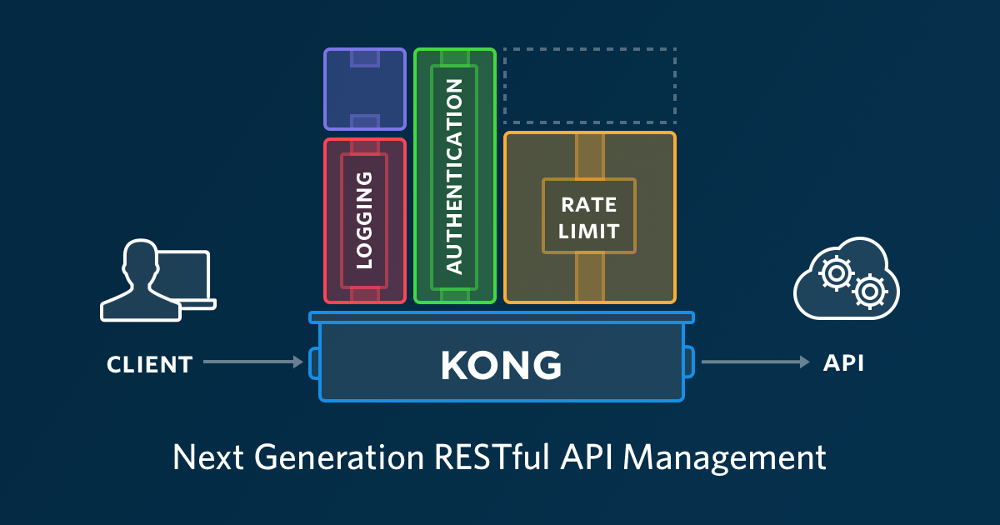
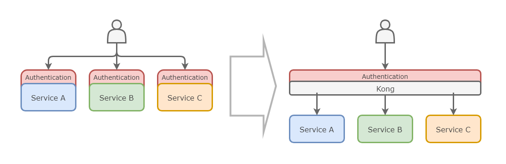

# Mijn Reis met Kong: Hoe ik API-beheer in Kubernetes Optimaliseerde

Als DevOps-professional ben ik altijd op zoek naar manieren om onze workflows efficiënter, veiliger en schaalbaarder te maken. De opkomst van microservices en cloud-native applicaties heeft het API-beheer complexer gemaakt dan ooit. Onlangs besloot ik Kong te verkennen, een krachtige open-source API-gateway die veelbelovend leek voor onze Kubernetes-omgeving. In deze blogpost neem ik je mee op mijn reis met Kong, deel ik mijn ervaringen en geef ik tips over hoe je Kong kunt implementeren en optimaliseren voor beter API-beheer.

## Bronnen

- Grafana Labs. (9 oktober 2024). Grafana Documentation. Geraadpleegd van [https://grafana.com/docs/](https://grafana.com/docs/)  
- HAProxy Technologies. (9 oktober 2024). HAProxy Documentation. Geraadpleegd van [https://www.haproxy.org/documentation/](https://www.haproxy.org/documentation/)  
- Jenkins. (9 oktober 2024). Jenkins Documentation. Geraadpleegd van [https://www.jenkins.io/doc/](https://www.jenkins.io/doc/)  
- Kubernetes. (9 oktober 2024). Kubernetes Documentation. Geraadpleegd van [https://kubernetes.io/docs/home/](https://kubernetes.io/docs/home/)  
- Kong. (9 oktober 2024-a). Kong for Kubernetes. Geraadpleegd van [https://docs.konghq.com/kubernetes-ingress-controller/](https://docs.konghq.com/kubernetes-ingress-controller/)  
- Kong. (9 oktober 2024-b). decK Documentation. Geraadpleegd van [https://docs.konghq.com/deck/](https://docs.konghq.com/deck/)  
- NGINX. (9 oktober 2024). NGINX Documentation. Geraadpleegd van [https://docs.nginx.com/](https://docs.nginx.com/)  
- Prometheus. (9 oktober 2024). Prometheus Documentation. Geraadpleegd van [https://prometheus.io/docs/introduction/overview/](https://prometheus.io/docs/introduction/overview/)  
- Traefik Labs. (9 oktober 2024). Traefik Documentation. Geraadpleegd van [https://doc.traefik.io/traefik/](https://doc.traefik.io/traefik/)  
- ChatGPT. (9 oktober 2024). Blogpost herschrijven naar markdown formaat en wat tekst toevoeging. Geraadpleegd van [https://chatgpt.com/share/67078e53-38f0-800e-8d59-2f7849e2fa73](https://chatgpt.com/share/67078e53-38f0-800e-8d59-2f7849e2fa73)  
- ChatGPT. (9 oktober 2024). Blogpost generatie en aanpassingen met gerichte prompts. Geraadpleegd van [https://chatgpt.com/share/67078e8f-0930-800e-a07b-6f6e11dc63e5](https://chatgpt.com/share/67078e8f-0930-800e-a07b-6f6e11dc63e5)  
- ChatGPT. (9 oktober 2024). Onderzoeksplan aanpassing. Geraadpleegd van [https://chatgpt.com/share/67078eba-25c0-800e-a53e-20f30848f3eb](https://chatgpt.com/share/67078eba-25c0-800e-a53e-20f30848f3eb)  
- ChatGPT. (9 oktober 2024). Verschil tussen Kong en native Ingress van Kubernetes. Geraadpleegd van [https://chatgpt.com/share/67078ed9-9278-800e-b133-47ea63b7544f](https://chatgpt.com/share/67078ed9-9278-800e-b133-47ea63b7544f)


## Waarom Kong? Een Diepgaande Kijk op de Kernfunctionaliteiten

Kong is een open-source API-gateway die als tussenlaag fungeert tussen clients en backend-services. Het beheert, beveiligt en optimaliseert API-verkeer, waardoor je eenvoudig functionaliteiten kunt toevoegen zoals load balancing, authenticatie, en observability

### Wat maakt Kong uniek?

Kong is een krachtige open-source API-gateway die zich onderscheidt van andere oplossingen zoals NGINX, Traefik en HAProxy. Dit komt door een aantal unieke eigenschappen die het API-beheer aanzienlijk verbeteren:

- **Uitbreidbaarheid met plugins**: Kong biedt een uitgebreid ecosysteem van zowel officiële als community-plugins. Dit maakt het eenvoudig om functionaliteiten toe te voegen zoals authenticatie, autorisatie, rate limiting en meer.
- **Hoge prestaties**: Gebouwd op Nginx en geschreven in Lua, kan Kong hoge verkeersvolumes aan met minimale latentie. Dit is essentieel voor applicaties die op grote schaal draaien.
- **Naadloze Kubernetes-integratie**: Met de Kong Ingress Controller kun je Kong eenvoudig integreren in je Kubernetes-cluster, waardoor je profiteert van geavanceerde API-beheerfunctionaliteiten.
- **Actieve community en ondersteuning**: Een grote en actieve open-source gemeenschap zorgt voor snelle updates, uitgebreide documentatie en ondersteuning bij problemen.

Met deze eigenschappen bleek Kong een uitstekende keuze voor onze Kubernetes-omgeving. De mogelijkheid om plugins te gebruiken zonder de backend-services aan te passen, maakt het een flexibele oplossing voor API-beheer.



### Kernfunctionaliteiten die mijn aandacht trokken

- **Load Balancing**: Automatische verdeling van verkeer over meerdere backend-services, wat bijdraagt aan de schaalbaarheid en betrouwbaarheid.
- **Beveiliging**: Ondersteuning voor diverse authenticatie- en autorisatiemethoden, zoals OAuth2, JWT en API-sleutels.
- **Observability**: Integratie met monitoring tools zoals Prometheus en Grafana voor real-time inzicht in prestaties en verkeer.
- **Protocol Ondersteuning**: Ondersteunt HTTP/1.1, HTTP/2 en gRPC, waardoor het geschikt is voor verschillende soorten applicaties.



## Implementatie van Kong in Kubernetes: Mijn stappenplan

Het opzetten van Kong in een Kubernetes-omgeving is eenvoudiger dan je wellicht denkt. Hieronder leg ik uit hoe ik Kong heb geïmplementeerd in een eenvoudige lokale Kubernetes-omgeving met behulp van Minikube. Dit stappenplan kan dienen als een solide basis voor iedereen die met Kong wil starten.

### Stap 1: Voorbereiding van de Kubernetes-Cluster

Allereerst moet je een Kubernetes-cluster opzetten. Voor lokale tests gebruikte ik Minikube, wat een handige tool is om een Kubernetes-omgeving te simuleren zonder dat je een complexe infrastructuur nodig hebt.

```bash
minikube start --cpus=4 --memory=8192
```

Dit commando start een lokale Kubernetes-cluster met voldoende resources om Kong soepel te laten draaien.

### Stap 2: Installatie van Kong met Helm

Om Kong te installeren gebruiken we Helm, de package manager voor Kubernetes. Helm maakt het eenvoudig om applicaties zoals Kong op een herhaalbare manier te installeren.

Voeg eerst de Helm-repository van Kong toe:

```bash
helm repo add kong https://charts.konghq.com
helm repo update
```

Vervolgens kun je Kong installeren:

```bash
helm install kong kong/kong --namespace kong --create-namespace
```

Met deze stappen heb je Kong in je Kubernetes-omgeving geïnstalleerd. Het is belangrijk om de juiste namespace te gebruiken zodat alle componenten netjes georganiseerd blijven.

### Stap 3: Configuratie van de Ingress Controller

Nu Kong is geïnstalleerd, kun je de Ingress Controller configureren om het verkeer naar je services te beheren en te routeren.

Hier is een voorbeeld van een Ingress Resource die door Kong wordt beheerd:

```yaml
apiVersion: networking.k8s.io/v1
kind: Ingress
metadata:
  name: my-service-ingress
  annotations:
    kubernetes.io/ingress.class: "kong"
spec:
  rules:
    - http:
        paths:
          - path: /api
            pathType: Prefix
            backend:
              service:
                name: my-service
                port:
                  number: 80
```

Met de annotatie `kubernetes.io/ingress.class: "kong"` geef je aan dat Kong deze Ingress-resource moet afhandelen. Het pad `/api` wordt gekoppeld aan de service `my-service`.

### Stap 4: Beveiliging implementeren met plugins

Een van de sterke punten van Kong is de mogelijkheid om beveiligingsmaatregelen toe te voegen zonder wijzigingen aan de backend-services.

Hier is een voorbeeld van het toevoegen van de Key Authentication Plugin:

```yaml
apiVersion: configuration.konghq.com/v1
kind: KongPlugin
metadata:
  name: key-auth-plugin
plugin: key-auth
```

Vervolgens kun je de plugin toepassen op een specifieke service:

```yaml
apiVersion: v1
kind: Service
metadata:
  name: my-service
  annotations:
    konghq.com/plugins: key-auth-plugin
spec:
  # Service details
```

Door de annotatie `konghq.com/plugins` toe te voegen aan de service, wordt de plugin toegepast op alle routes die naar deze service leiden.

### Stap 5: Integratie in de DevOps pipeline

Om ervoor te zorgen dat de configuratie van Kong consistent blijft, kun je de deployment automatiseren met behulp van CI/CD-tools. Hier is een voorbeeld van een Jenkins-pipeline die de deployment van Kong automatiseert:

```groovy
pipeline {
    agent any
    stages {
        stage('Deploy Kong') {
            steps {
                sh 'helm upgrade --install kong kong/kong --namespace kong'
            }
        }
    }
}
```

Door Kong in je DevOps-pipeline op te nemen, kun je wijzigingen snel en foutloos implementeren.

## Best practices voor configuratie en beveiliging

Tijdens het implementatieproces heb ik verschillende best practices geïdentificeerd die ik graag deel.

### Gebruik declaratieve configuratie met decK

Het beheren van Kong-configuraties met decK zorgt voor versiebeheer en maakt het eenvoudig om wijzigingen bij te houden en te auditen (Kong, z.d.-b).

Installatie en Basisgebruik:

```bash
brew install deck
deck dump -o kong.yaml  # Exporteer huidige configuratie
deck sync -s kong.yaml  # Synchroniseer configuratie
```

**Voordelen**:

- **Versiebeheer**: Configuraties kunnen worden opgeslagen in een VCS zoals Git.
- **Consistentie**: Voorkomt configuratiedrift tussen omgevingen.
- **Automatisering**: Integratie met CI/CD-pipelines voor automatische deployments.

### Implementeer rate limiting en beveiliging

Om onze APIs te beschermen tegen overbelasting en aanvallen, implementeerden we de Rate Limiting plugin.

Rate Limiting Configuratie:

```yaml
apiVersion: configuration.konghq.com/v1
kind: KongPlugin
metadata:
  name: rate-limiting
plugin: rate-limiting
config:
  minute: 100
  policy: local
```

**Toelichting**:

- Beperkt het aantal verzoeken tot 100 per minuut per consument.
- De `policy: local` betekent dat de limiet per node wordt toegepast.

### Monitoring en logging met Prometheus en Grafana

Voor real-time inzicht in API-verkeer en prestaties integreerden we Kong met Prometheus en Grafana.

Prometheus plugin Toevoegen:

```yaml
apiVersion: configuration.konghq.com/v1
kind: KongPlugin
metadata:
  name: prometheus
plugin: prometheus
```

**Stappen**:

- Prometheus installeren in je cluster.
- Grafana dashboards configureren met de data uit Prometheus.
- Alerts instellen voor kritieke metrics.

**Voordelen**:

- **Inzicht**: Real-time monitoring van latentie, throughput en foutpercentages.
- **Probleemoplossing**: Snellere identificatie en oplossing van problemen.
- **Capaciteitsplanning**: Beter begrip van resourcegebruik voor toekomstige scaling.

## Uitdagingen en oplossingen

Geen implementatie is zonder uitdagingen. Hier zijn enkele obstakels die ik tegenkwam en hoe ik ze heb overwonnen.

### Configuratiecomplexiteit

**Uitdaging**: Het beheren van meerdere services, routes en plugins werd complex naarmate het aantal toenam.

**Oplossing**:

- **Gebruik van decK**: Door declaratieve configuratie konden we de complexiteit beheersen.
- **Naming Conventions**: Consistente en duidelijke naamgevingsregels hielpen bij het overzicht.
- **Documentatie**: Gedetailleerde documentatie van alle configuraties en wijzigingen.

### Debugging en foutopsporing

**Uitdaging**: Het identificeren van problemen in een gedistribueerde omgeving was lastig.

**Oplossing**:

- **Gedetailleerde logging**: Inschakelen van uitgebreide logging in Kong en het gebruik van log-aggregatietools zoals ELK-stack.
- **Kong Admin API**: Gebruik maken van de Admin API voor diagnostiek en het bekijken van realtime configuraties.

### Prestatieproblemen

**Uitdaging**: Bij hoge verkeersvolumes merkten we verhoogde latentie.

**Oplossing**:

- **Resource Allocatie**: Toewijzen van voldoende resources aan de Kong-pods.
- **Horizontale Schaling**: Gebruik maken van Kubernetes' autoscaling om Kong-pods automatisch te schalen.
- **Monitoring**: Continu monitoren van prestaties en proactief reageren op trends.

## Tips voor een succesvolle simplementatie

Op basis van mijn ervaringen heb ik enkele aanbevelingen voor degenen die overwegen Kong te implementeren.

- **Begin met een Proof of Concept**: Test Kong in een gesimuleerde omgeving om vertrouwd te raken met de functionaliteiten.
- **Maak Gebruik van de Community**: De Kong-community is een waardevolle bron voor ondersteuning en best practices.
- **Automatiseer Waar Mogelijk**: Gebruik CI/CD-pipelines en declaratieve configuratie om menselijke fouten te minimaliseren.
- **Blijf Leren en Updaten**: De technologie evolueert snel; zorg dat je op de hoogte blijft van nieuwe releases en features.
- **Security First**: Implementeer vanaf het begin beveiligingsmaatregelen en voer regelmatig audits uit.

## Conclusie: Kong als onmisbare tool in mijn DevOps toolkit

Mijn reis met Kong heeft me laten zien hoe krachtig en flexibel een goed geïmplementeerde API-gateway kan zijn. Door de kernfunctionaliteiten van Kong te benutten en deze uit te breiden met zowel standaard als community-plugins, heb ik het API-beheer binnen onze Kubernetes-omgeving aanzienlijk kunnen verbeteren.

### Belangrijkste Voordelen die ik Heb Ondervonden:

- **Verbeterde Beveiliging**: Door het eenvoudig toepassen van beveiligingsplugins konden we onze APIs beter beschermen zonder ingrijpende codewijzigingen.
- **Schaalbaarheid**: Kong's prestatieschaalbaarheid stelde ons in staat om zonder zorgen meer verkeer te verwerken.
- **Centralisatie van API Beheer**: Met Kong konden we het beheer van verschillende APIs centraliseren, wat het onderhoud vereenvoudigde.

Of je nu net begint met microservices of al een complexe infrastructuur hebt, Kong biedt de tools en flexibiliteit om je API-beheer naar een hoger niveau te tillen.

Ik moedig je aan om zelf op ontdekkingstocht te gaan met Kong en te ervaren hoe het jouw DevOps-processen kan optimaliseren.