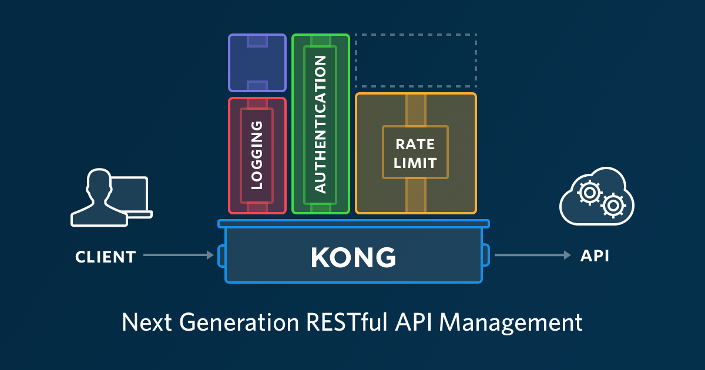
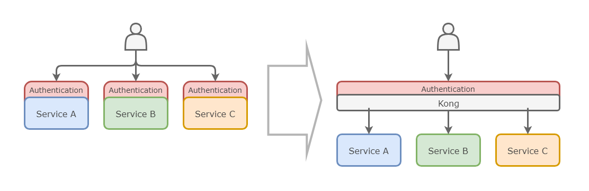

## Mijn Reis met Kong: Hoe ik API-beheer in Kubernetes Optimaliseerde
**Guven Ciddioglu, oktober 2024**

---

<figure style="float: right; width: 250px; margin-left: 10px;">
    
    <figcaption style="text-align: center;">
        Figuur 1: Kong logo 
        <a href="https://webcatalog.io/en/apps/kong//" target="_blank">Bron</a>
    </figcaption>
</figure>

Als DevOps-professional ben ik altijd op zoek naar manieren om onze workflows efficiënter, veiliger en schaalbaarder te maken. De opkomst van microservices en cloud-native applicaties heeft het API-beheer complexer gemaakt dan ooit. Onlangs besloot ik Kong te verkennen, een krachtige open-source API-gateway die veelbelovend leek voor onze Kubernetes-omgeving.

In deze blogpost neem ik je mee op mijn reis met Kong. Ik bespreek de unieke eigenschappen van Kong en waarom het een goede keuze is voor API-beheer in Kubernetes. Vervolgens geef ik een stappenplan voor de implementatie van Kong in een Kubernetes-omgeving. Ik deel best practices voor configuratie en beveiliging, waaronder authenticatie, rate limiting en logging. Daarnaast bespreek ik de uitdagingen die ik tegenkwam en hoe ik ze heb opgelost. Tot slot geef ik tips voor een succesvolle implementatie van Kong.

Laten we beginnen!
---

### Inhoudsopgave
1. [Waarom Kong? Een Diepgaande Kijk op de Kernfunctionaliteiten](#waarom-kong-een-diepgaande-kijk-op-de-kernfunctionaliteiten)
2. [Implementatie van Kong in Kubernetes: Mijn stappenplan](#implementatie-van-kong-in-kubernetes-mijn-stappenplan)
3. [Best practices voor configuratie en beveiliging](#best-practices-voor-configuratie-en-beveiliging)
4. [Uitdagingen en oplossingen](#uitdagingen-en-oplossingen)
5. [Tips voor een succesvolle implementatie](#tips-voor-een-succesvolle-implementatie)
6. [Conclusie: Kong als onmisbare tool in mijn DevOps-toolkit](#conclusie-kong-als-onmisbare-tool-in-mijn-devops-toolkit)
7. [Bronnen](#bronnen)

### Waarom Kong? Een Diepgaande Kijk op de Kernfunctionaliteiten

Kong is een open-source API-gateway die fungeert als tussenlaag tussen clients en backend-services, en beheert, beveiligt en optimaliseert API-verkeer. Het biedt eenvoudige toevoeging van functionaliteiten zoals load balancing, authenticatie, en observability, wat het ideaal maakt voor het centraliseren en optimaliseren van API-infrastructuur.

Kong onderscheidt zich van alternatieven zoals NGINX, Traefik en HAProxy door zijn uitbreidbaarheid en prestaties. Het ondersteunt een breed scala aan officiële en community-plugins, waardoor functies als authenticatie, autorisatie en rate limiting gemakkelijk kunnen worden toegevoegd. Gebouwd op Nginx en geschreven in Lua, kan Kong hoge verkeersvolumes aan met minimale latentie, wat essentieel is voor grootschalige toepassingen.

Bovendien integreert Kong naadloos met Kubernetes via de Kong Ingress Controller, wat dynamisch schalen en automatische routing mogelijk maakt zonder extra complexiteit. Dankzij de actieve community zijn er regelmatige updates en uitgebreide ondersteuning, wat zorgt voor een betrouwbare oplossing voor API-beheer.

Kong blijkt hiermee een uitstekende keuze voor onze Kubernetes-omgeving, vooral dankzij de flexibiliteit om plugins te gebruiken zonder de backend-services aan te passen.

Zoals te zien in Figuur 1, biedt Kong een breed scala aan functionaliteiten die essentieel zijn voor modern API-beheer.

  
*Figuur 2: Overzicht van de kernfunctionaliteiten van Kong ([Bron](https://scaleout.ninja/post/starting-with-kong/))*

**Kernfunctionaliteiten die mijn aandacht trokken**
- **Load Balancing**: Automatische verdeling van verkeer over meerdere backend-services, wat bijdraagt aan schaalbaarheid en betrouwbaarheid.
- **Beveiliging**: Ondersteuning voor diverse authenticatie- en autorisatiemethoden, zoals OAuth2, JWT en API-sleutels.
- **Observability**: Integratie met monitoringtools zoals Prometheus en Grafana voor real-time inzicht in prestaties en verkeer.
- **Protocolondersteuning**: Ondersteunt HTTP/1.1, HTTP/2 en gRPC, waardoor het geschikt is voor verschillende soorten applicaties.

Figuur 2 illustreert hoe Kong deze functionaliteiten inzet om API-beheer te vereenvoudigen, met nadruk op authenticatie, rate limiting en logging.

  
*Figuur 3: Hoe Kong API-beheer vereenvoudigt ([Bron](https://scaleout.ninja/post/starting-with-kong/))*


Zoals te zien in Figuur 2, biedt Kong oplossingen voor veelvoorkomende uitdagingen in API-beheer, waaronder authenticatie, rate limiting en logging. In de volgende secties zal ik uitleggen hoe ik deze functionaliteiten heb geïmplementeerd en geoptimaliseerd.

### Implementatie van Kong in Kubernetes: Mijn stappenplan

Het opzetten van Kong in een Kubernetes-omgeving is eenvoudiger dan je wellicht denkt. Hieronder leg ik uit hoe ik Kong heb geïmplementeerd in een eenvoudige lokale Kubernetes-omgeving met behulp van Minikube. Dit stappenplan kan dienen als basis voor iedereen die met Kong wil starten.

**Stap 1: Voorbereiding van de Kubernetes-cluster**
Allereerst moet je een Kubernetes-cluster opzetten. Voor lokale tests gebruikte ik Minikube, een handige tool om een Kubernetes-omgeving te simuleren zonder dat je een complexe infrastructuur nodig hebt.

```bash
minikube start --cpus=4 --memory=8192
```
Dit commando start een lokale Kubernetes-cluster met voldoende resources om Kong soepel te laten draaien.

**Stap 2: Installatie van Kong met Helm**
Om Kong te installeren gebruiken we Helm, de package manager voor Kubernetes. Helm maakt het eenvoudig om applicaties zoals Kong op een herhaalbare manier te installeren.

Voeg eerst de Helm-repository van Kong toe:

```bash
helm repo add kong https://charts.konghq.com
helm repo update
```
Vervolgens kun je Kong installeren:

```bash
helm install kong kong/kong --namespace kong --create-namespace
```
Met deze stappen heb je Kong in je Kubernetes-omgeving geïnstalleerd. Het is belangrijk om de juiste namespace te gebruiken zodat alle componenten netjes georganiseerd blijven.

**Stap 3: Configuratie van de Ingress Controller**
Nu Kong is geïnstalleerd, kun je de Ingress Controller configureren om het verkeer naar je services te beheren en te routeren.

Hier is een voorbeeld van een Ingress Resource die door Kong wordt beheerd:

```yaml
apiVersion: networking.k8s.io/v1
kind: Ingress
metadata:
  name: my-service-ingress
  annotations:
    kubernetes.io/ingress.class: "kong"
spec:
  rules:
    - http:
        paths:
          - path: /api
            pathType: Prefix
            backend:
              service:
                name: my-service
                port:
                  number: 80
```
Met de annotatie `kubernetes.io/ingress.class: "kong"` geef je aan dat Kong deze Ingress Resource moet afhandelen. Het pad `/api` wordt gekoppeld aan de service `my-service`.

**Stap 4: Integratie in de DevOps-pipeline**
Om ervoor te zorgen dat de configuratie van Kong consistent blijft, kun je de deployment automatiseren met behulp van CI/CD-tools. Hier is een voorbeeld van een Jenkins-pipeline die de deployment van Kong automatiseert:

```groovy
pipeline {
    agent any
    stages {
        stage('Deploy Kong') {
            steps {
                sh 'helm upgrade --install kong kong/kong --namespace kong'
            }
        }
    }
}
```
Door Kong in je DevOps-pipeline op te nemen, kun je wijzigingen snel en foutloos implementeren.

### Best practices voor configuratie en beveiliging

**Gebruik declaratieve configuratie met decK**
Het beheren van Kong-configuraties met decK zorgt voor versiebeheer en maakt het eenvoudig om wijzigingen bij te houden en te auditen (Kong, z.d.-b).

Installatie en basisgebruik:

```bash
brew install deck
deck dump -o kong.yaml  # Exporteer huidige configuratie
deck sync -s kong.yaml  # Synchroniseer configuratie
```

**Implementeer authenticatie**
Een belangrijk aspect van API-beheer is het beveiligen van je APIs met de juiste authenticatiemechanismen. Kong maakt het eenvoudig om verschillende vormen van authenticatie toe te passen zonder je backend-services aan te passen.

Hier is een voorbeeld van het toevoegen van de Key Authentication Plugin:

```yaml
apiVersion: configuration.konghq.com/v1
kind: KongPlugin
metadata:
  name: key-auth-plugin
plugin: key-auth
```
Vervolgens kun je de plugin toepassen op een specifieke service:

```yaml
apiVersion: v1
kind: Service
metadata:
  name: my-service
  annotations:
    konghq.com/plugins: key-auth-plugin
spec:
  # Service details
```

**Implementeer rate limiting**
Om onze APIs te beschermen tegen overbelasting en aanvallen, implementeerden we de Rate Limiting Plugin.

Rate Limiting Configuratie:

```yaml
apiVersion: configuration.konghq.com/v1
kind: KongPlugin
metadata:
  name: rate-limiting
plugin: rate-limiting
config:
  minute: 100
  policy: local
```

### Uitdagingen en oplossingen

Tijdens de implementatie van Kong kwamen er enkele uitdagingen naar voren die opgelost moesten worden. Eén van de belangrijkste uitdagingen was de configuratiecomplexiteit. Naarmate het aantal services, routes en plugins toenam, werd het beheren ervan steeds ingewikkelder. Door gebruik te maken van declaratieve configuraties met decK konden we deze complexiteit echter beheersen. Ook zorgde consistente naamgeving en duidelijke documentatie ervoor dat we overzicht hielden over alle configuraties en wijzigingen.

Een ander probleem was het debuggen en foutopsporing in een gedistribueerde omgeving. Het identificeren van problemen was niet altijd eenvoudig. Om dit op te lossen, schakelden we gedetailleerde logging in via Kong en maakten we gebruik van log-aggregatietools zoals de ELK-stack. Daarnaast bood de Kong Admin API nuttige inzichten voor diagnostiek en realtime configuraties.

Tot slot kwamen prestatieproblemen naar voren bij hogere verkeersvolumes, die resulteerden in verhoogde latentie. Dit werd aangepakt door voldoende resources toe te wijzen aan de Kong-pods en gebruik te maken van Kubernetes' autoscaling om Kong-pods automatisch te schalen. Monitoring was hierbij essentieel om prestatieproblemen snel te identificeren en op te lossen.

### Tips voor een succesvolle implementatie

- **Begin met een Proof of Concept**: Test Kong in een gesimuleerde omgeving om vertrouwd te raken met de functionaliteiten.
- **Maak gebruik van de community**: De Kong-community is een waardevolle bron voor ondersteuning en best practices.
- **Automatiseer waar mogelijk**: Gebruik CI/CD-pipelines en declaratieve configuratie om menselijke fouten te minimaliseren.
- **Blijf leren en updaten**: Zorg dat je op de hoogte blijft van nieuwe releases en features.
- **Security first**: Implementeer vanaf het begin beveiligingsmaatregelen en voer regelmatig audits uit.

### Conclusie: Kong als onmisbare tool in mijn DevOps-toolkit

Mijn reis met Kong heeft me laten zien hoe krachtig en flexibel een goed geïmplementeerde API-gateway kan zijn. Door de kernfunctionaliteiten van Kong te benutten en deze uit te breiden met zowel standaard als community-plugins, heb ik het API-beheer binnen onze Kubernetes-omgeving aanzienlijk kunnen verbeteren.

Belangrijkste voordelen die ik heb ondervonden:
- **Verbeterde beveiliging**: Door het eenvoudig toepassen van beveiligingsplugins konden we onze APIs beter beschermen zonder ingrijpende codewijzigingen.
- **Schaalbaarheid**: Kong's prestatieschaalbaarheid stelde ons in staat om zonder zorgen meer verkeer te verwerken.
- **Centralisatie van API-beheer**: Met Kong konden we het beheer van verschillende APIs centraliseren, wat het onderhoud vereenvoudigde.

Ik moedig je aan om zelf op ontdekkingstocht te gaan met Kong en te ervaren hoe het jouw DevOps-processen kan optimaliseren.

### Bronnen

* Grafana Labs. (9 oktober 2024). Grafana Documentation. Geraadpleegd van [https://grafana.com/docs/](https://grafana.com/docs/)  
* HAProxy Technologies. (9 oktober 2024). HAProxy Documentation. Geraadpleegd van * [https://www.haproxy.org/documentation/](https://www.haproxy.org/documentation/)  
* Jenkins. (9 oktober 2024). Jenkins Documentation. Geraadpleegd van [https://www.jenkins.io/doc/](https://www.jenkins.io/doc/)  
* Kubernetes. (9 oktober 2024). Kubernetes Documentation. Geraadpleegd van [https://kubernetes.io/docs/home/](https://kubernetes.io/docs/home/)  
* Kong. (9 oktober 2024-a). Kong for Kubernetes. Geraadpleegd van [https://docs.konghq.com/kubernetes-ingress-controller/](https://docs.konghq.com/kubernetes-ingress-controller/)  
* Kong. (9 oktober 2024-b). decK Documentation. Geraadpleegd van [https://docs.konghq.com/deck/](https://docs.konghq.com/deck/)  
* NGINX. (9 oktober 2024). NGINX Documentation. Geraadpleegd van [https://docs.nginx.com/](https://docs.nginx.com/)  
* Prometheus. (9 oktober 2024). Prometheus Documentation. Geraadpleegd van [https://prometheus.io/docs/introduction/overview/](https://prometheus.io/docs/introduction/overview/)  
* Traefik Labs. (9 oktober 2024). Traefik Documentation. Geraadpleegd van [https://doc.traefik.io/traefik/](https://doc.traefik.io/traefik/)  
* ChatGPT. (9 oktober 2024). Blogpost herschrijven naar markdown formaat en wat tekst toevoeging. Geraadpleegd van [https://chatgpt.com/share/67078e53-38f0-800e-8d59-2f7849e2fa73](https://chatgpt.com/share/67078e53-38f0-800e-8d59-2f7849e2fa73)  
* ChatGPT. (9 oktober 2024). Blogpost generatie en aanpassingen met gerichte prompts. Geraadpleegd van [https://chatgpt.com/share/67078e8f-0930-800e-a07b-6f6e11dc63e5](https://chatgpt.com/share/67078e8f-0930-800e-a07b-6f6e11dc63e5)  
* ChatGPT. (9 oktober 2024). Onderzoeksplan aanpassing. Geraadpleegd van [https://chatgpt.com/share/67078eba-25c0-800e-a53e-20f30848f3eb](https://chatgpt.com/share/67078eba-25c0-800e-a53e-20f30848f3eb)  
* ChatGPT. (9 oktober 2024). Verschil tussen Kong en native Ingress van Kubernetes. Geraadpleegd van [https://chatgpt.com/share/67078ed9-9278-800e-b133-47ea63b7544f](https://chatgpt.com/share/67078ed9-9278-800e-b133-47ea63b7544f)